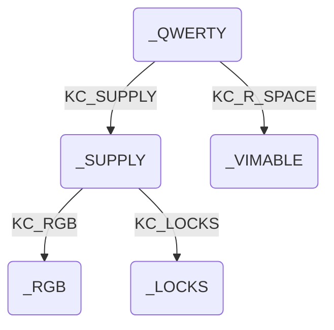

### Hardware

*Epomaker MiniCat69 @ STM32F401*

### Keymap layers

```mermaid
graph TD;
    q(_QWERTY)--KC_SUPPLY-->s(_SUPPLY);
    q--KC_R_SPACE-->v(_VIMABLE)
    s--KC_RGB-->r(_RGB);
    s--KC_LOCKS-->l(_LOCKS);
```
